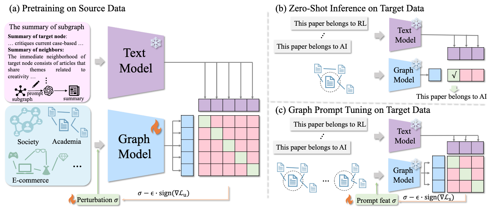

# GraphCLIP: Enhancing Transferability in Graph Foundation Models for Text-Attributed Graphs



## Updates
- [x] [2024.11.01] We have uploaded the source datasets.
- [x] [2024.11.03] We have uploaded the target datasets and the pretrained checkpoint.
- [ ] How to apply GraphCLIP on customized datasets.


## 1. Environment setup
```
conda create -n graphclip python=3.10
conda activate graphclip
pip install torch==2.4.1 torchvision==0.19.1 torchaudio==2.4.1 --index-url https://download.pytorch.org/whl/cu121
pip install torch_geometric
```

## 2. Datasets
### For source data
1. This repository includes the smallest source dataset, i.e., pubmed. For larger-scale source datasets, please download generated graph summaries:

|Datasets  | Links |  
|--|--|
|OGBN-ArXiv|[Google Drive](https://drive.google.com/file/d/1AeAnnqPui05FuBX7JvWQMJA8kr2CIFYS/view?usp=sharing)|
| ArXiv\_2023| [Google Drive](https://drive.google.com/file/d/1t1icJvRtw9OBpc88uws_wIsKFoVHtM0D/view?usp=sharing)|
| Reddit|[Google Drive](https://drive.google.com/file/d/1c7gtoy918suLlUN5a8CYUGCEbzYAeSeX/view?usp=sharing) |
|OGBN-Products|[Google Drive](https://drive.google.com/file/d/1IAmU8mAJ-rVzFu1iOkvQes1RtS8-RU-M/view?usp=sharing)|

2. Once downloaded, unzip the files and place them in the `summary` directory.

3. For convenience, we also provide the processed data, which includes the graph structure and node features. Please download them following:

|Datasets  | Links |  
|--|--|
|OGBN-ArXiv|[Google Drive](https://drive.google.com/file/d/1fAiycw9s22hhVGLO_FbVMoyIMkOkC6UL/view?usp=sharing)|
|ArXiv\_2023|[Google Drive](https://drive.google.com/file/d/1hvVaQtxy7y92KM2I-WY1ZOmwjaUfufi5/view?usp=sharing)|
|Reddit|[Google Drive](https://drive.google.com/file/d/1KWTMMByOsnDod78ueEufeN2jNdq99IGk/view?usp=sharing)|
|OGBN-Products|[Google Drive](https://drive.google.com/file/d/1vRNT9n2UMx_-nFEG4IB6kkV408TxYUSb/view?usp=sharing)|

1. Once downloaded, unzip the files and place them in the `processed_data` directory.

### For target data
1. For target datasets, we only need to download processed data, unzip them and put them into `processed_data` directory. 
   
|Datasets  | Links |  
|--|--|
|WikiCS|[Google Drive](https://drive.google.com/file/d/1vOo_Iql19Eccgr8t6H70AYIvxwu87846/view?usp=sharing)|
|Instagram|[Google Drive](https://drive.google.com/file/d/1c9ZkdHyDHKaInGnmXlLGjYIPeTY-njF7/view?usp=sharing)|
|Ele-Photo|[Google Drive](https://drive.google.com/file/d/1qFMixgszCODpo7e7syhucUjKYr75T8cx/view?usp=sharing)|
|Ele-Computers|[Google Drive](https://drive.google.com/file/d/1487we3C9AJryvAMCCH0W7YA0nXFQ1H8o/view?usp=sharing)|
|Books-History|[Google Drive](https://drive.google.com/file/d/1zAlK6BdQy0YmwPu9M5GXbImLrDQS4BON/view?usp=sharing)|

2. As for subgraphs, please run `bash gen_target_subg.sh` to generate subgraphs for each target dataset.

## 3. Pretraining on source data
### Downloading and loading our pretrained checkpoint

To get started, download our [released checkpoint](https://drive.google.com/file/d/178RikDLXPy-4eMGDhG5V6RzmlJhp-8fy/view?usp=sharing) and unzip the content. Place the extracted files into the `checkpoints` directory. You can then use this checkpoint directly on your target datasets, as outlined in the next section.

### Or training from scratch
```
# We provide the smallest source data (pubmed) for running our codes
# single gpu
CUDA_VISIBLE_DEVICES=0 python train.py --source_data pubmed --batch_size 1024 --epochs 30
# multiple gpus
CUDA_VISIBLE_DEVICES=0,1 python train.py --source_data pubmed --batch_size 1024 --epochs 30
# reproduce our results
CUDA_VISIBLE_DEVICES=0,1,2,3,4,5,6,7 python train.py --source_data ogbn-arxiv+arxiv_2023+pubmed+ogbn-products+reddit --batch_size 7200 --epochs 30
```

> We use 8 A100(40G) GPUs for pretraining with ~7 hours  

> This code supports Data Parallel, you can assign multiple gpus here.
## 4. Zero-shot learning on target data
We provide a sample target dataset (citeseer) for running our code. By default, this will load your pretrained checkpoint.
```
CUDA_VISIBLE_DEVICES=0 python eval.py --target_data citeseer
```
> more target datasets can be evaluated: --target_data cora+citeseer+wikics+instagram+photo+computer+history

To reproduce our experiments, use the `--ckpt` flag to specify the pretrained checkpoint, and provide the name of the downloaded checkpoint.
```
CUDA_VISIBLE_DEVICES=0 python eval.py --target_data cora+citeseer+wikics+instagram+photo+computer+history --ckpt pretrained_graphclip
```


