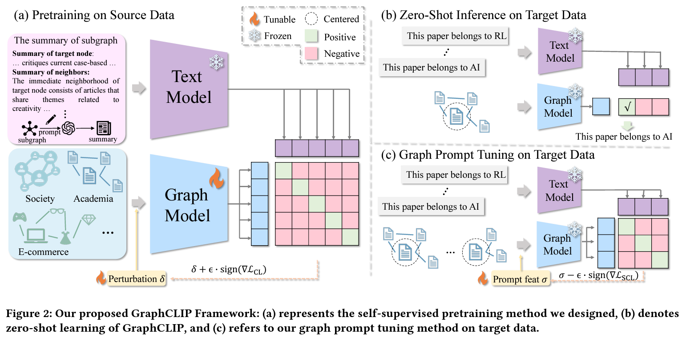

# GraphCLIP: Enhancing Transferability in Graph Foundation Models for Text-Attributed Graphs


> We will release our pretrained checkpoint and all the datasets we used  on Google Driver after the anonymous phase.

## Updates
[2024.11.1] We have uploaded the source datasets.

## Environment Setup
```
conda create -n graphclip python=3.10
conda activate graphclip
pip install torch==2.4.1 torchvision==0.19.1 torchaudio==2.4.1 --index-url https://download.pytorch.org/whl/cu121
pip install torch_geometric
```

## Datasets
### For source data
This repository includes the smallest source dataset, i.e., pubmed. For larger-scale source datasets, please download generated graph summaries:
|Datasets  | Links |  
|--|--|
|OGBN-ArXiv|[Google Drive](https://drive.google.com/file/d/1AeAnnqPui05FuBX7JvWQMJA8kr2CIFYS/view?usp=sharing)|
| ArXiv\_2023| [Google Drive](https://drive.google.com/file/d/1t1icJvRtw9OBpc88uws_wIsKFoVHtM0D/view?usp=sharing)|
| Reddit|[Google Drive](https://drive.google.com/file/d/1c7gtoy918suLlUN5a8CYUGCEbzYAeSeX/view?usp=sharing) |
|OGBN-Products|[Google Drive](https://drive.google.com/file/d/1IAmU8mAJ-rVzFu1iOkvQes1RtS8-RU-M/view?usp=sharing)|

Once downloaded, unzip the files and place them in the `summary` directory.

For convenience, we also provide the processed data, which includes the graph structure and node features. Please download them following:
|Datasets  | Links |  
|--|--|
|OGBN-ArXiv|[Google Drive](https://drive.google.com/file/d/1fAiycw9s22hhVGLO_FbVMoyIMkOkC6UL/view?usp=sharing)|
|ArXiv\_2023|[Google Drive](https://drive.google.com/file/d/1hvVaQtxy7y92KM2I-WY1ZOmwjaUfufi5/view?usp=sharing)|
|Reddit|[Google Drive](https://drive.google.com/file/d/1KWTMMByOsnDod78ueEufeN2jNdq99IGk/view?usp=sharing)|
|OGBN-Products|TODO|

Once downloaded, unzip the files and place them in the `processed_data` directory.

<!-- ### For target data
This repository includes the smallest target dataset, i.e., citeseer. For larger-scale target datasets, please download [wikics]() and [](). Once downloaded, unzip the files and place them in the `summary` directory. -->

## Pretraining on source data
```
# We provide the smallest source data (pubmed) for running our codes
# single gpu
CUDA_VISIBLE_DEVICES=0 python train.py --source_data pubmed --batch_size 1024 --epochs 30
# multiple gpus
CUDA_VISIBLE_DEVICES=0,1 python train.py --source_data pubmed --batch_size 1024 --epochs 30
```

> --source_data obgn-arxiv+arxiv\_2023+pubmed+ogbn-products+reddit is used in our paper, use + gather multiple source datasets.

> This code supports Data Parallel, you can assign multiple gpus here.
## Zero-shot learning on target data
```
# We provide one target data (citeseer) for running our codes
CUDA_VISIBLE_DEVICES=0 python eval.py --target_data citeseer
```

> more target datasets can be evaluated in the future version: --target_data cora+citeseer+wikics+instagram+photo+computer+history
